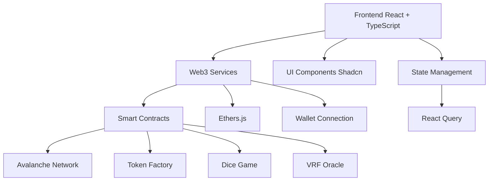

# 📚 Documentation Technique - Avalanche Token Forge

## Table des Matières

1. [Architecture Générale](#-architecture-générale)
2. [Smart Contracts](#-smart-contracts)
3. [Services Frontend](#-services-frontend)
4. [Configuration](#-configuration)
5. [API Reference](#-api-reference)
6. [Deployment](#-deployment)
7. [Troubleshooting](#-troubleshooting)
8. [Advanced Usage](#-advanced-usage)

---

## 🏗️ Architecture Générale

### **Stack Technique**



### **Flow de l'Application**

1. **Connexion Wallet** : L'utilisateur connecte son wallet MetaMask
2. **Interaction Smart Contracts** : Via ethers.js pour toutes les opérations blockchain
3. **Gestion d'État** : React Query pour le cache et la synchronisation
4. **UI Reactive** : Mise à jour en temps réel des données blockchain

---

## 📝 Smart Contracts

### **1. CustomERC20Token.sol**

Factory pour créer des tokens ERC-20 personnalisés.

```solidity
contract CustomERC20Token {
    string public name;
    string public symbol;
    uint8 public decimals;
    uint256 public totalSupply;
    address public owner;
    string public imageUrl;
    
    constructor(
        string memory _name,
        string memory _symbol,
        uint8 _decimals,
        uint256 _initialSupply,
        address _owner,
        string memory _imageUrl
    ) {
        // Implementation...
    }
}
```

**Fonctionnalités :**
- ✅ Standard ERC-20 complet
- ✅ Métadonnées personnalisées (nom, symbole, image)
- ✅ Supply initiale configurable
- ✅ Ownership management

### **2. DiceGameContract.sol**

Contrat de jeu de dés avec Chainlink VRF.

```solidity
contract DiceGameContract {
    using Chainlink for Chainlink.Request;
    
    struct Game {
        address player;
        address token;
        uint256 betAmount;
        uint256 prediction;
        uint256 result;
        bool isComplete;
    }
    
    mapping(uint256 => Game) public games;
    
    function placeBet(
        address _token,
        uint256 _amount,
        uint256 _prediction
    ) external returns (uint256 gameId) {
        // Implementation...
    }
}
```

**Fonctionnalités :**
- 🎲 Randomisation sécurisée via Chainlink VRF
- 💰 Support multi-tokens
- 🔒 Sécurité anti-manipulation
- 📊 Historique des parties

### **3. VRFSubscriptionManager.sol**

Gestionnaire pour les abonnements Chainlink VRF.

```solidity
contract VRFSubscriptionManager {
    VRFCoordinatorV2Interface immutable coordinator;
    uint64 public subscriptionId;
    
    function createSubscription() external onlyOwner {
        subscriptionId = coordinator.createSubscription();
    }
}
```

---

## ⚙️ Services Frontend

### **1. TokenService**

Service principal pour la gestion des tokens.

```typescript
class TokenService {
    private static instance: TokenService;
    private contract: Contract;
    
    // Singleton pattern
    static getInstance(): TokenService {
        if (!TokenService.instance) {
            TokenService.instance = new TokenService();
        }
        return TokenService.instance;
    }
    
    // Créer un nouveau token
    async createToken(params: CreateTokenParams): Promise<string> {
        const tx = await this.contract.createToken(
            params.name,
            params.symbol,
            params.decimals,
            params.initialSupply,
            params.imageUrl
        );
        return tx.hash;
    }
    
    // Récupérer tous les tokens
    async getAllTokens(): Promise<Token[]> {
        const tokens = await this.contract.getAllTokens();
        return tokens.map(this.formatToken);
    }
}
```

### **2. WalletService**

Gestion de la connexion et des interactions wallet.

```typescript
class WalletService {
    private provider: ethers.providers.Web3Provider | null = null;
    private signer: ethers.Signer | null = null;
    
    async connectWallet(): Promise<string> {
        if (typeof window.ethereum !== 'undefined') {
            await window.ethereum.request({ 
                method: 'eth_requestAccounts' 
            });
            
            this.provider = new ethers.providers.Web3Provider(window.ethereum);
            this.signer = this.provider.getSigner();
            
            return await this.signer.getAddress();
        }
        throw new Error('Wallet non détecté');
    }
    
    async switchToAvalanche(): Promise<void> {
        await window.ethereum.request({
            method: 'wallet_switchEthereumChain',
            params: [{ chainId: '0xA86A' }], // Avalanche Mainnet
        });
    }
}
```

### **3. GamblingService**

Service pour les jeux de hasard.

```typescript
class GamblingService {
    private diceContract: Contract;
    
    async placeBet(
        tokenAddress: string,
        amount: BigNumber,
        prediction: number
    ): Promise<string> {
        const tx = await this.diceContract.placeBet(
            tokenAddress,
            amount,
            prediction
        );
        return tx.hash;
    }
    
    async getGameResult(gameId: number): Promise<GameResult> {
        return await this.diceContract.games(gameId);
    }
}
```

---

## 🔧 Configuration

### **Variables d'Environnement**

```env
# Réseau Avalanche
VITE_AVALANCHE_RPC_URL=https://api.avax.network/ext/bc/C/rpc
VITE_CHAIN_ID=43114
VITE_NETWORK_NAME=Avalanche

# Contrats (à déployer)
VITE_TOKEN_FACTORY_ADDRESS=0x...
VITE_DICE_GAME_ADDRESS=0x...
VITE_VRF_MANAGER_ADDRESS=0x...

# Chainlink VRF
VITE_VRF_COORDINATOR=0x...
VITE_KEY_HASH=0x...
VITE_SUBSCRIPTION_ID=...

# API Keys (optionnel)
VITE_INFURA_KEY=your_infura_key
VITE_ALCHEMY_KEY=your_alchemy_key
```

### **Configuration Réseau**

```typescript
// src/config/rpcConfig.ts
export const AVALANCHE_CONFIG = {
    chainId: 43114,
    chainName: 'Avalanche Network',
    nativeCurrency: {
        name: 'AVAX',
        symbol: 'AVAX',
        decimals: 18,
    },
    rpcUrls: ['https://api.avax.network/ext/bc/C/rpc'],
    blockExplorerUrls: ['https://snowtrace.io/'],
};

export const CONTRACT_ADDRESSES = {
    TOKEN_FACTORY: import.meta.env.VITE_TOKEN_FACTORY_ADDRESS,
    DICE_GAME: import.meta.env.VITE_DICE_GAME_ADDRESS,
    VRF_MANAGER: import.meta.env.VITE_VRF_MANAGER_ADDRESS,
};
```

---

## 📡 API Reference

### **Token Operations**

#### Créer un Token
```typescript
interface CreateTokenParams {
    name: string;           // Nom du token
    symbol: string;         // Symbole (3-4 caractères)
    decimals: number;       // Nombre de décimales (18 recommandé)
    initialSupply: number;  // Supply initiale
    imageUrl?: string;      // URL de l'image (optionnel)
}

// Usage
const tokenHash = await tokenService.createToken({
    name: "Mon Token",
    symbol: "MTK",
    decimals: 18,
    initialSupply: 1000000,
    imageUrl: "https://example.com/logo.png"
});
```

#### Acheter des Tokens
```typescript
interface BuyTokenParams {
    tokenAddress: string;   // Adresse du contrat token
    amountInAVAX: string;  // Montant en AVAX
    slippage?: number;     // Tolérance de slippage (défaut: 2%)
}

// Usage
const txHash = await tokenService.buyToken({
    tokenAddress: "0x...",
    amountInAVAX: "1.5",
    slippage: 2
});
```

### **Gambling Operations**

#### Placer un Pari
```typescript
interface BetParams {
    tokenAddress: string;   // Token utilisé pour parier
    amount: string;        // Montant du pari
    prediction: number;    // Prédiction (1-6 pour le dé)
}

// Usage
const gameId = await gamblingService.placeBet({
    tokenAddress: "0x...",
    amount: "100",
    prediction: 4
});
```

### **Wallet Operations**

#### États de Connexion
```typescript
enum WalletStatus {
    DISCONNECTED = 'disconnected',
    CONNECTING = 'connecting',
    CONNECTED = 'connected',
    ERROR = 'error'
}

// Hook personnalisé
const { 
    address, 
    status, 
    connect, 
    disconnect,
    balance 
} = useWallet();
```

---

## 🚀 Deployment

### **1. Build de Production**

```bash
# Build optimisé
npm run build

# Preview local
npm run preview

# Analyse du bundle
npm run build:analyze
```

### **2. Déploiement des Smart Contracts**

```bash
# Compilation
npx hardhat compile

# Tests
npx hardhat test

# Déploiement sur Avalanche Testnet
npx hardhat run scripts/deploy.js --network fuji

# Déploiement sur Avalanche Mainnet
npx hardhat run scripts/deploy.js --network avalanche
```

### **3. Déploiement Frontend**

#### Vercel (Recommandé)
```bash
# Installation Vercel CLI
npm i -g vercel

# Déploiement
vercel --prod
```

#### Netlify
```bash
# Build
npm run build

# Déploiement manuel
# Uploadez le dossier dist/ sur Netlify
```

### **4. Configuration IPFS (Optionnel)**

```bash
# Installation IPFS
npm install -g ipfs

# Ajout à IPFS
ipfs add -r dist/

# Pin sur un service IPFS
ipfs pin add <hash>
```

---

## 🐛 Troubleshooting

### **Problèmes Courants**

#### 1. Wallet non détecté
```typescript
// Vérification
if (typeof window.ethereum === 'undefined') {
    console.error('MetaMask non installé');
    // Rediriger vers instructions d'installation
}
```

#### 2. Réseau incorrect
```typescript
// Vérification du réseau
const chainId = await window.ethereum.request({ 
    method: 'eth_chainId' 
});

if (chainId !== '0xA86A') {
    await walletService.switchToAvalanche();
}
```

#### 3. Transactions échouées
```typescript
// Gestion d'erreur robuste
try {
    const tx = await contract.someMethod();
    await tx.wait(); // Attendre confirmation
} catch (error) {
    if (error.code === 'INSUFFICIENT_FUNDS') {
        toast.error('Fonds insuffisants');
    } else if (error.code === 'USER_REJECTED') {
        toast.error('Transaction annulée');
    } else {
        toast.error(`Erreur: ${error.message}`);
    }
}
```

### **Debug Mode**

```typescript
// Activation des logs détaillés
if (import.meta.env.DEV) {
    window.ethereum.on('chainChanged', (chainId) => {
        console.log('Chain changed:', chainId);
    });
    
    window.ethereum.on('accountsChanged', (accounts) => {
        console.log('Accounts changed:', accounts);
    });
}
```

---

## 🔥 Advanced Usage

### **Custom Hooks**

#### useToken
```typescript
const useToken = (tokenAddress: string) => {
    return useQuery({
        queryKey: ['token', tokenAddress],
        queryFn: () => tokenService.getTokenDetails(tokenAddress),
        refetchInterval: 30000, // Refresh toutes les 30s
    });
};
```

#### useWallet
```typescript
const useWallet = () => {
    const [address, setAddress] = useState<string | null>(null);
    const [status, setStatus] = useState<WalletStatus>(WalletStatus.DISCONNECTED);
    
    const connect = useCallback(async () => {
        setStatus(WalletStatus.CONNECTING);
        try {
            const addr = await walletService.connectWallet();
            setAddress(addr);
            setStatus(WalletStatus.CONNECTED);
        } catch (error) {
            setStatus(WalletStatus.ERROR);
        }
    }, []);
    
    return { address, status, connect };
};
```

### **Optimisations Performance**

#### Code Splitting
```typescript
// Lazy loading des pages
const CreateToken = lazy(() => import('./pages/CreateToken'));
const Gambling = lazy(() => import('./pages/Gambling'));

// Dans App.tsx
<Suspense fallback={<Loading />}>
    <Routes>
        <Route path="/create" element={<CreateToken />} />
        <Route path="/gambling" element={<Gambling />} />
    </Routes>
</Suspense>
```

#### Memoization
```typescript
// Memoization des composants coûteux
const TokenCard = memo(({ token }: { token: Token }) => {
    // Component logic
});

// Memoization des calculs
const tokenValue = useMemo(() => {
    return calculateTokenValue(token.price, token.balance);
}, [token.price, token.balance]);
```

### **Extensions Futures**

#### 1. Staking
```solidity
contract TokenStaking {
    mapping(address => uint256) public stakedAmount;
    mapping(address => uint256) public stakingTimestamp;
    
    function stake(uint256 amount) external {
        // Implementation du staking
    }
    
    function unstake() external {
        // Implementation du unstaking
    }
}
```

#### 2. Liquidity Pools
```solidity
contract LiquidityPool {
    mapping(address => uint256) public liquidityProviders;
    
    function addLiquidity(uint256 tokenAmount, uint256 avaxAmount) external {
        // Implementation de l'ajout de liquidité
    }
}
```

#### 3. NFT Integration
```typescript
interface NFTMetadata {
    name: string;
    description: string;
    image: string;
    attributes: Array<{
        trait_type: string;
        value: string;
    }>;
}

// Service NFT
class NFTService {
    async mintNFT(metadata: NFTMetadata): Promise<string> {
        // Implementation du mint NFT
    }
}
```

---

## 📊 Monitoring & Analytics

### **Event Tracking**

```typescript
// Analytics personnalisés
class Analytics {
    static trackTokenCreation(tokenData: any) {
        // Tracking création de token
        gtag('event', 'token_created', {
            token_name: tokenData.name,
            token_symbol: tokenData.symbol,
        });
    }
    
    static trackTrade(tradeData: any) {
        // Tracking des trades
        gtag('event', 'token_traded', {
            value: tradeData.amount,
            currency: 'AVAX',
        });
    }
}
```

### **Health Checks**

```typescript
// Vérification de la santé de l'app
class HealthCheck {
    static async checkNetworkStatus(): Promise<boolean> {
        try {
            const provider = new ethers.providers.JsonRpcProvider(
                import.meta.env.VITE_AVALANCHE_RPC_URL
            );
            await provider.getBlockNumber();
            return true;
        } catch {
            return false;
        }
    }
    
    static async checkContractStatus(): Promise<boolean> {
        try {
            const contract = new ethers.Contract(
                CONTRACT_ADDRESSES.TOKEN_FACTORY,
                TokenFactoryABI,
                provider
            );
            await contract.owner();
            return true;
        } catch {
            return false;
        }
    }
}
```

---

<div align="center">

**🎯 Cette documentation est maintenue par l'équipe Avalanche Token Forge**

Pour toute question technique, ouvrez une [issue GitHub](https://github.com/Simonhamel1/avalanche-token-forge/issues)

</div>
